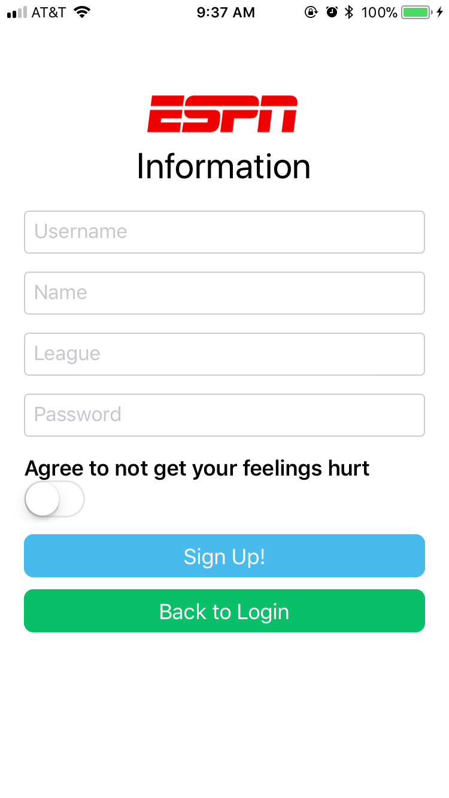
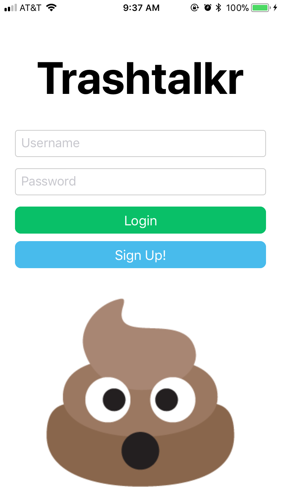
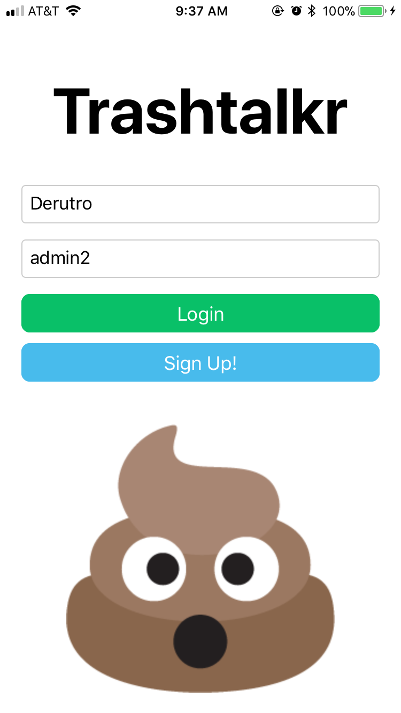
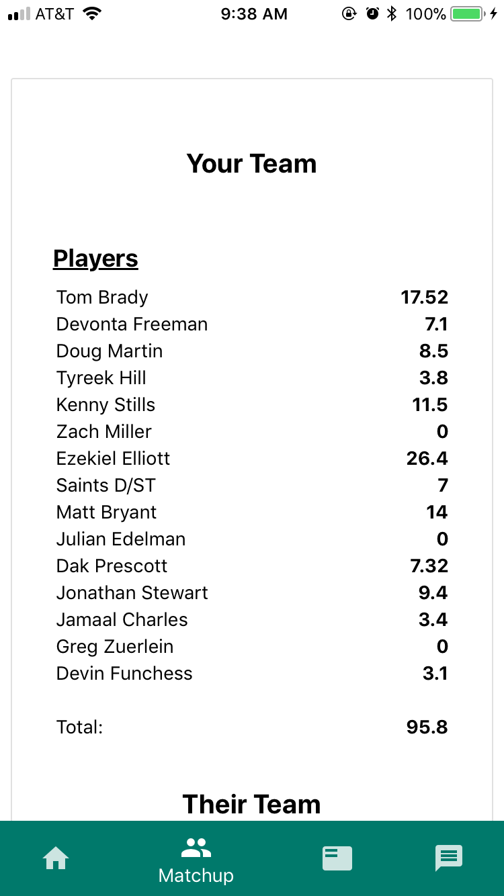
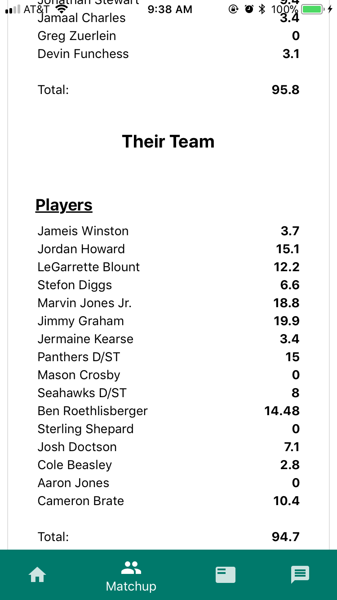
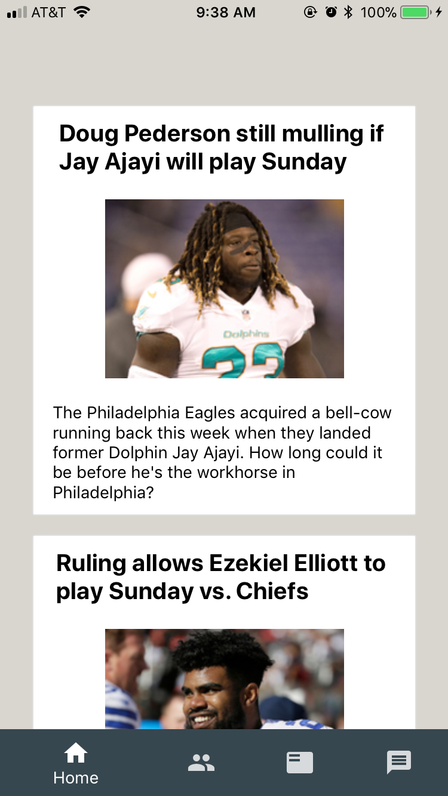
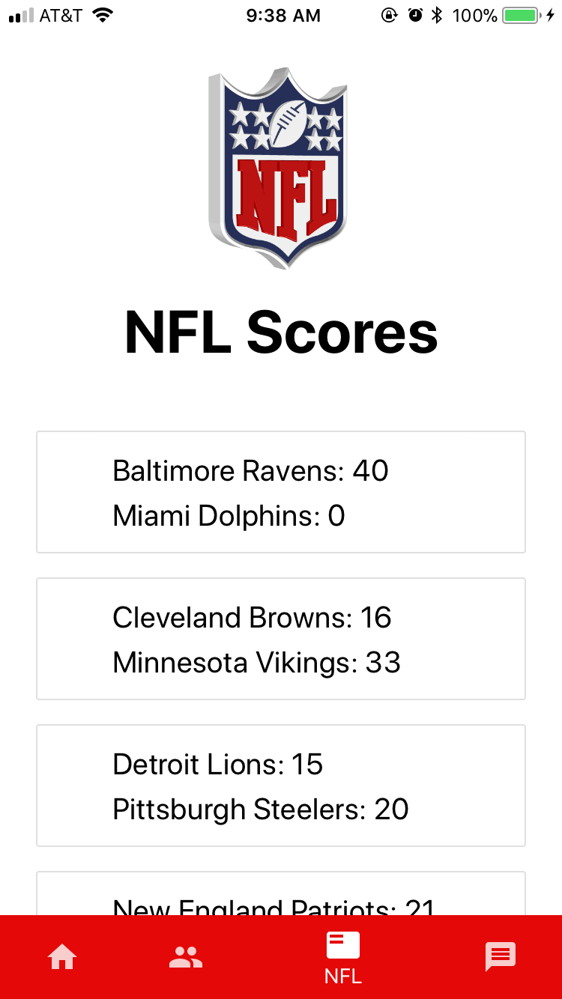
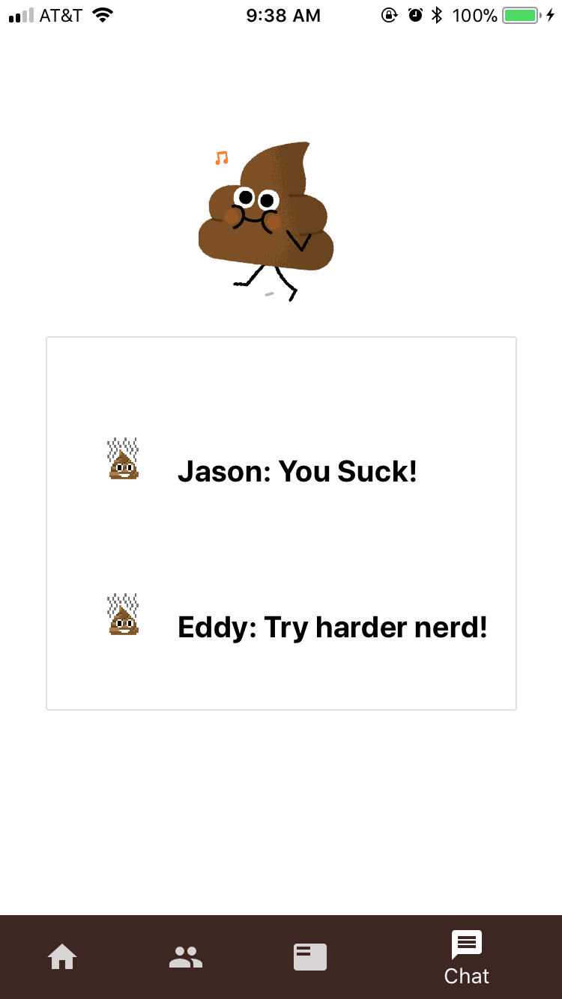

# Trashtalkr

 

 
 
 

##  What is it?
Trashtalkr is a react native app that uses the ESPN API to gather fantasy football league data. The app then uses that data to show your your weekly matchup, display your current team and player stats, as well as automatically talk trash to the opponent that is losing during that specific matchup.

### Sign up with your ESPN credentials.

 

### Login to your existing Trashtalkr account.

### App will open to your current week matchup.

### Home page is a news feed from "newsapi.org".

### NFl page is weekly NFL team game scores.

### Trashtalkr page is where you can view your messages that Trashtalkr sent you.

